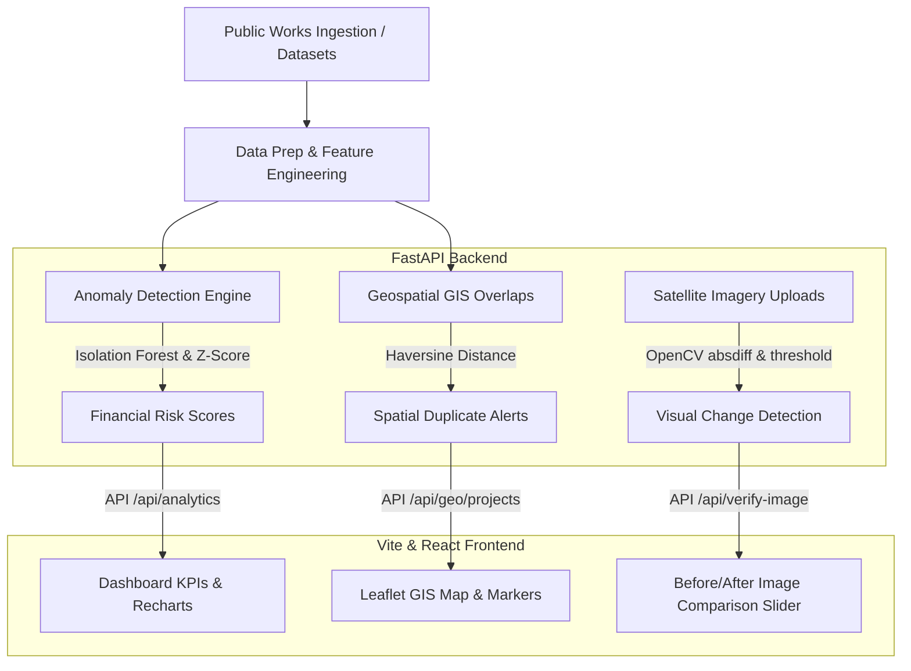

# VERITAS - AI-Assisted Public Works Risk Intelligence

VERITAS is an AI-assisted public works risk intelligence and monitoring platform built for **MPLADS** (Member of Parliament Local Area Development Scheme). It automatically ingests and evaluates public works datasets to flag cost deviations, physical-financial mismatches, geospatial duplicate overlaps, contract-splitting procurement patterns, and visual satellite change anomalies, surfacing them to auditors.

> **Team:** ByteCrew  
> **Problem Statement:** SIH26102  
> **Ministry:** Ministry of Statistics and Programme Implementation (MoSPI)  
> **Theme:** Smart Automation  
> **Category:** Software  

---

## 🏗️ System Flow & Architecture



---

## 🛠️ Project Tech Stack
* **Backend:** FastAPI (Python), Pandas, Scikit-learn (Isolation Forest & Z-Score ML model), OpenCV-python / Pillow (Image Difference algorithm).
* **Frontend:** React (Vite), Tailwind CSS v4, Leaflet & React Leaflet (GIS mapping), Recharts (data visualizations), Lucide React (icons).

---

## ⚙️ Local Setup Instructions

### 1. Prerequisites
Make sure you have **Node.js (v18+)** and **Python (v3.11+)** installed on your system.

### 2. Backend Installation & Start
Open a terminal in the root project folder:

```bash
# Create virtual environment
python -m venv venv

# Activate virtual environment
# On Windows PowerShell:
venv\Scripts\activate
# On Linux/macOS:
source venv/bin/activate

# Install dependencies
pip install -r requirements.txt

# Start FastAPI server
uvicorn backend.main:app --host 127.0.0.1 --port 8000
```
The API documentation is accessible at `http://127.0.0.1:8000/docs`.

### 3. Frontend Installation & Start
Open a second terminal inside the `frontend` folder:

```bash
# Install node dependencies
npm install

# Run the development server
npm run dev
```
Open `http://localhost:5173/` in your browser. The Vite server includes proxy endpoints configured to query the FastAPI backend directly.

> [!TIP]
> **Windows Security / Execution Policy Fix:**  
> If PowerShell blocks launching Vite with: `"File C:\Program Files\nodejs\npm.ps1 cannot be loaded because running scripts is disabled on this system"`, run the dev server via CMD:
> ```bash
> cmd /c npm run dev
> ```

---

## 🌐 Sharing the Live Prototype (WhatsApp/Demo)

### Option A: Share over the internet (Localtunnel)
To send a live link to anyone in the world over WhatsApp:
1. Open a new terminal.
2. Run the following command:
   ```bash
   npx localtunnel --port 5173
   ```
3. Copy the generated public URL (e.g. `https://xyz.loca.lt`) and share it.

### Option B: Share on the same Wi-Fi
If sharing with someone in the same room on the same Wi-Fi connection:
1. Stop your Vite server (`Ctrl + C`).
2. Run:
   ```bash
   cmd /c npm run dev -- --host
   ```
3. Send the **Network URL** (e.g., `http://192.168.1.15:5173/`) to your friend.

---

## 🚀 Hackathon 2-Minute Demo Story
To execute the live presentation, locate the floating **DEMO CONSOLE** in the bottom-right corner of the web interface and click the scenarios sequentially:

1. **1. COST DEVIATION:** Navigates to Jabalpur road work `VR-JBP-044` highlighting the 3.5× cost deviation compared to the ₹10.0L prototype baseline.
2. **2. PROGRESS MISMATCH:** Navigates to Hyderabad water work `VR-HYD-032` displaying a 92% fund utilization rate vs only 18% physical progress.
3. **3. SPATIAL DUPLICATE:** Switches to **Geo Intelligence** showing Varanasi works `VR-VNS-047` & `VR-VNS-048` linked within 43 meters, indicating potential spatial duplication.
4. **4. VISUAL VERIFICATION:** Opens the satellite verification image comparison slider with change detection metrics.
5. **5. PROCUREMENT CLUSTER:** Switches to **Procurement** displaying Contractor A's split contracts under the ₹10.0L sanction threshold in Lucknow.

